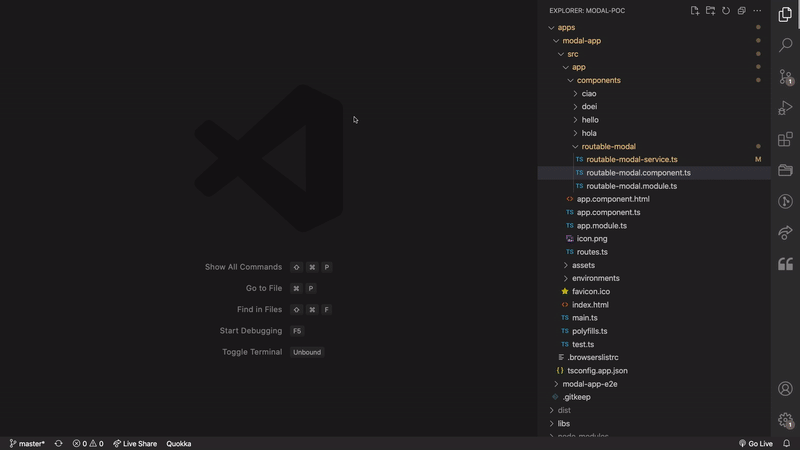

# vs-code-ng-generate-tests

This vs code extension is used to generate angular unit tests. The extension uses [ng-generate-tests](https://github.com/kood-codes/ng-generate-tests) This is used as a demonstration for my blog article ["Ok Google", Generate unit tests for me](https://blog.kood.dev/)

* Run `npm run package` to package the extension
* Run `code --install-extension ng-generate-tests-1.0.0.tgz` to install the extension 
* Run `code --uninstall-extension ng-generate-tests-1.0.0.tgz` to uninstall the extension

**Enjoy!**
